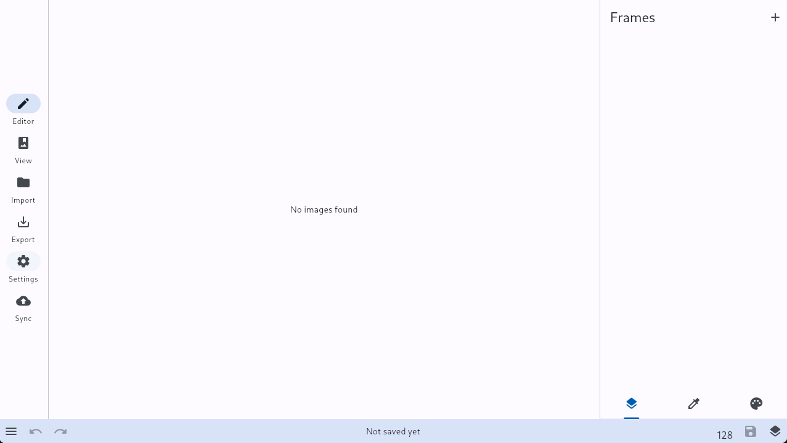
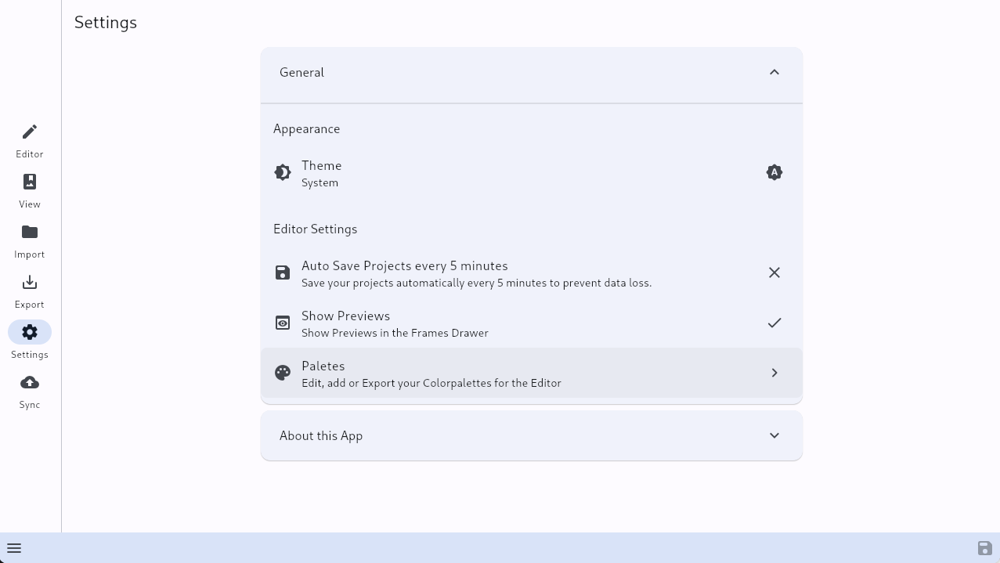
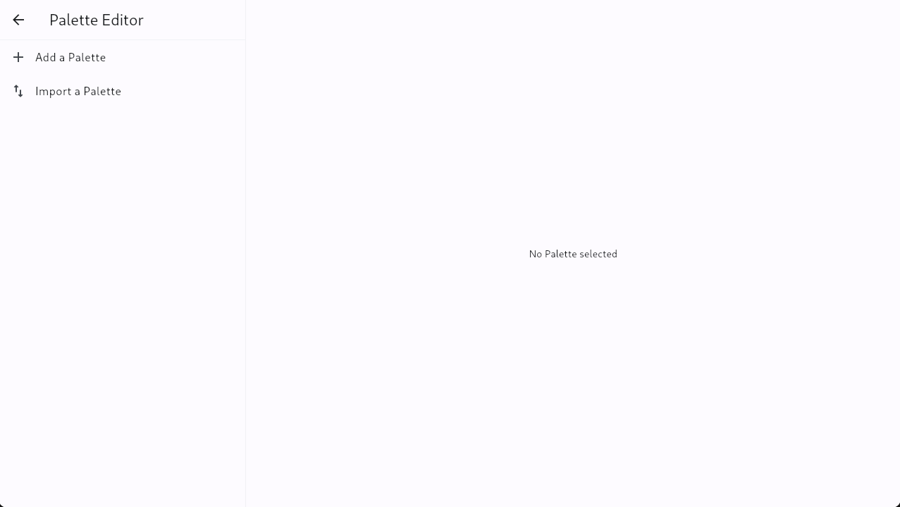
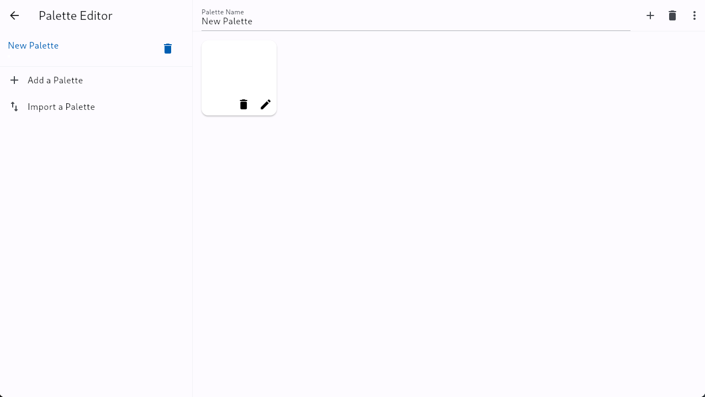
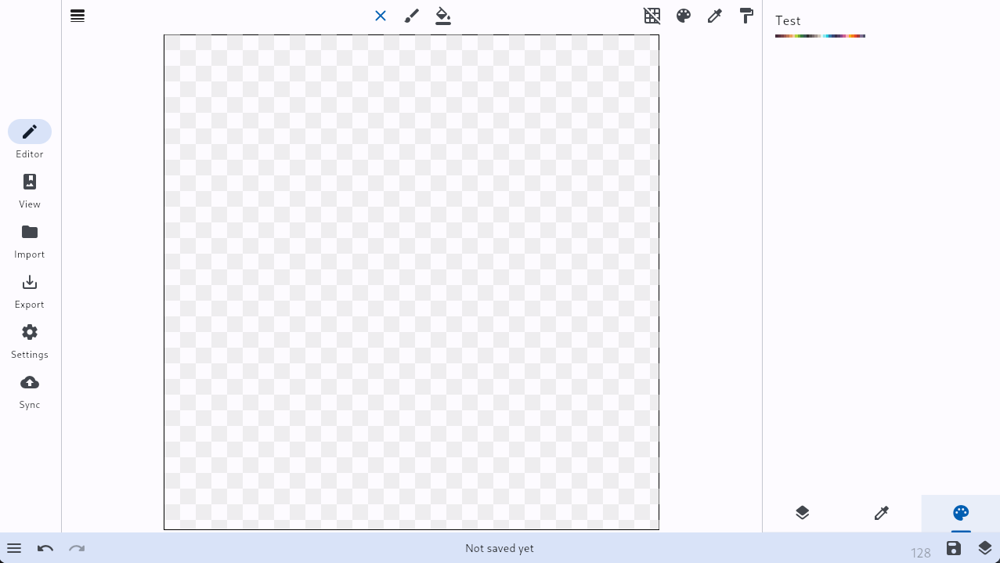
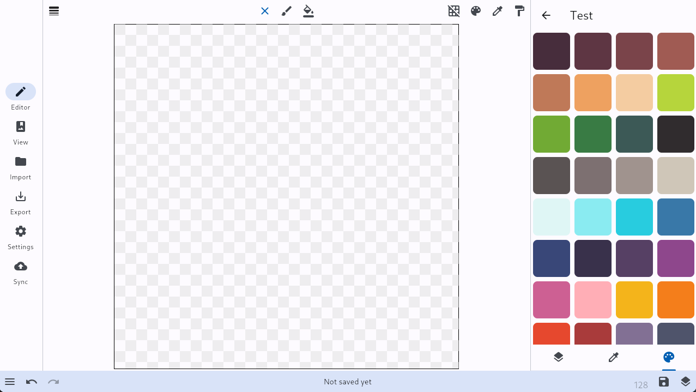

# Color Palettes
Gooftuber Editor now supports Color Palettes! In this short document, we will show you how to use it, import Color Palettes and how to use them.

## What are Color Palettes?
In Pixel-Art-like Editors, Artists often use with a thing called "Color Palettes". They are a set amount of Colors the Artist can work with and is used to this day to mimick limitations Computers had back in the day of only being able to show a limited amount of colors at a time.

## How do you use it?
It is pretty simple. First things first, head into the **Settings** tab on the left side.

Then, expand the **General** Category, under **Editor Settings**, you'll find the **Palettes** Option.

Now, you'll be greeted by the Palette Editor!

The rundown is pretty simple. You can use the buttons "**Add a Palette**" to manually create a brand-new Color Palette for you to use.
The rundown is pretty simple. You can use the buttons "**Import a Palette**" to import a pre-existing Color Palette. (It supports PNG-Color-Palettes, like found in Aseprite!)

### Manually creating a Palette 

This Interface can look overwhelming at first, but dont fret! It is quite simple :)

On each color, like the white card you see in the image above, there aer 2-3 buttons visible. A Delete button, an Edit button and, when you hover over it, a Checkbox.

- With the Delete button, you remove that Color from the Palette.
- With the Edit button, you modify the Color.
- With the checkbox, you can mark a Color for deletion.

On the bar at the top, you can name your Palette. (In this case, it's the default name "New Palette")

Next to that, is an **Add Color** button. You use it to add new Colors.

Next is a Delete button. You use it to *completely* remove the Color Palette.

And finally, there is a More-Options button, which shows you options to save/export your Color Palettes.

### Importing a Color Palette
You can export your Color Palettes from Aseprite as a PNG (Save Palette option). That PNG can be read and interpreted by Gooftuber Avatar Editor and allows you to use that exact Palette in our Program.

**It also works in reverse, too!** Just export your Color Palette as a PNG and import it in Aseprite, if you so choose :)

Finally, theres an option to import from a JSON. This JSON is created inside the Gooftuber Avatar Editor.

## Using Color Palettes inside the Editor

If a Color Palette exists, a new Tab will show up in the Drawer on the right-hand side. The Palette tab!

Select it, and a list of your palettes will appear (see above).

Select the Palette you wish to use, and you'll be presented by this screen.

Now you find a list of all your cool colors, easy for you to use :)

If you wish to return to the selection for your palettes, simply click the back button next to the name.