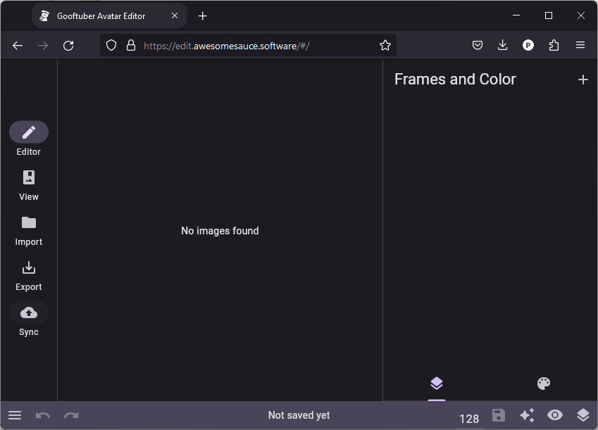
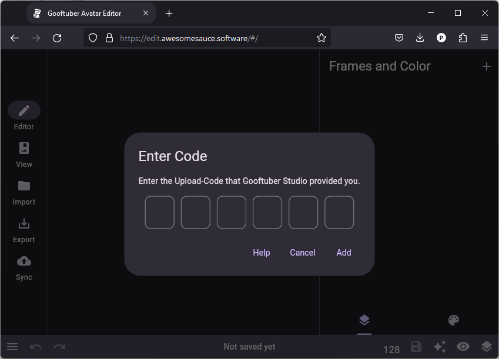

# Syncing Avatars from Editor to Studio

So you want to be extra lazy today and have a seamless way to edit your avatars for Gooftuber Studio? Well you are in luck, because us, the programmers, went through pain to make your life easier.

#### Here are the steps to use the Sync Functionality:

1. In the Gooftuber Studio Program, open the Main Menu by pressing Escape.  
    (Image TBD)
2. Select "Sync Avatar"  
    (Image TBD)
3. Open up the [Gooftuber Editor.](https://edit.awesomesauce.software)
4. On the left-hand side, select "Sync"  
    
5. Enter the Code received in Gooftuber Studio, it is always 6 digits long and lasts 5 minutes.  
    
6. Click "Add", you should see an "Upload successful!" in the corner of the Editor.
7. Check in Gooftuber Studio if the new Avatars have appeared.
